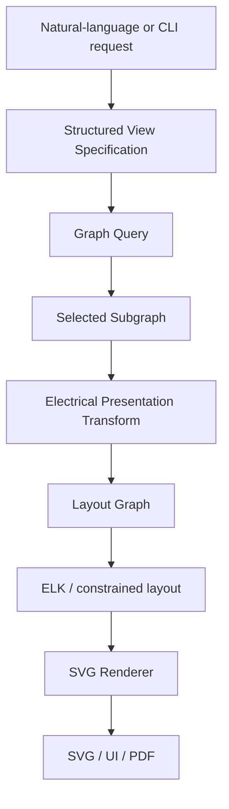

# Schematic Rendering

## Goal

The renderer must generate conventional, readable electrical schematics from arbitrary useful slices of the system model.

A generic graph layout is not sufficient. Electrical diagrams carry strong presentation conventions: signal/power flow, symbol port locations, rail structure, contact/coil relationships, field-versus-panel grouping, orthogonal conductors, and meaningful grouping.

The renderer therefore needs an **electrical presentation layer** between graph query and automatic layout.

## Pipeline



## 1. Structured view specification

Natural language should not directly control geometry.

The agent converts a request such as:

> Show LS204 back to the PLC and include its field power.

into a deterministic view specification, conceptually:

```json
{
  "roots": ["LS204"],
  "traverse": [
    {
      "kind": "electrical",
      "direction": "both",
      "until_roles": ["plc_io", "power_source"]
    }
  ],
  "include": ["terminals", "conductors", "protection"],
  "presentation": "control"
}
```

The precise query language can remain small initially. The important boundary is that once this specification exists, selection and rendering are deterministic.

## 2. Graph query

The query engine selects the relevant IR objects.

Examples:

- `device M1 + conductive path to source`;
- `LS204 + path to PLC I/O + field power`;
- `all conductors belonging to CBL104`;
- `all terminals on derived net +24VDC`;
- `all objects functionally capable of interrupting K1 actuation`.

The result is a semantic subgraph, not yet a drawing.

## 3. Electrical presentation transform

This stage decides what kind of schematic structure is appropriate.

It may:

- classify nodes as source, protection, control, field, load, return, PLC I/O, terminal block, etc.;
- collapse irrelevant internal detail;
- expand device internals that matter for the requested view;
- create visual groups for enclosures or field areas;
- select symbol variants;
- establish preferred flow direction;
- choose whether related contacts appear adjacent or cross-referenced;
- decide which conductor/net labels are useful;
- insert presentation-only junction points where necessary.

These transformations do **not** change electrical truth. They create a view model optimized for human understanding.

### Example: motor control view

The transform may establish a conceptual ordering such as:

```text
control source
   ↓
protection
   ↓
permissive / stop chain
   ↓
command logic
   ↓
contactor coil
   ↓
return
```

### Example: PLC I/O view

The same graph may instead become:

```text
FIELD                         PANEL

LS201 ─────────────────────┐
LS202 ─────────────────────┤
PS203 ─────────────────────┼── PLC1 / DI module
LS204 ─────────────────────┤
PE205 ─────────────────────┘
```

No alternate source drawing is required.

## 4. Symbols and ports

Symbols should be deterministic vector definitions with named ports corresponding to component terminals.

Conceptually:

```json
{
  "id": "iec:contactor-coil",
  "bounds": { "width": 40, "height": 20 },
  "ports": {
    "A1": { "side": "west", "offset": 0.5 },
    "A2": { "side": "east", "offset": 0.5 }
  }
}
```

Graphical primitives may initially be limited to:

- line;
- polyline/path;
- rectangle;
- circle;
- arc;
- text.

The symbol system should eventually support presentation variants without requiring electrical types to duplicate geometry.

IEC 60617 is the obvious semantic reference for electrotechnical symbols, but the official database/artwork has licensing restrictions. The project should avoid assuming that IEC assets can simply be redistributed.

## 5. Layout strategy

The first implementation should use the Eclipse Layout Kernel (ELK), likely through `elkjs`, as a layout solver rather than writing graph layout from scratch.

ELK is attractive because it separates layout calculation from rendering and supports concepts useful to electrical schematics:

- explicit ports on nodes;
- fixed port sides and ordering;
- layered flow;
- orthogonal edge routing;
- hierarchical/compound graphs;
- deterministic configuration.

The electrical renderer should own semantic constraints; ELK should solve geometry within those constraints.

Conceptually:

```text
Electrical rules
    ↓
preferred node groups
preferred flow direction
fixed symbol port sides
port order
hierarchy
    ↓
ELK layered layout
    ↓
node positions + routed edges
    ↓
our SVG renderer
```

This prevents the layout library from becoming the electrical domain model.

## 6. Orthogonal routing and junctions

Industrial schematics generally benefit from horizontal/vertical routing and deliberate junction semantics.

The renderer must distinguish:

- crossing lines that are electrically unrelated;
- true conductive junctions;
- shared routes/buses;
- terminal-block transitions;
- jumpers.

Those distinctions come from the electrical IR, not from graphical coincidence.

A line intersection must never create connectivity merely because two SVG paths cross.

## 7. Determinism

A foundational requirement:

> Same resolved model + same normalized view specification + same renderer/symbol versions should produce visually identical output.

The LLM does not place symbols.

This matters for:

- reproducible documentation;
- Git/CI artifact comparison;
- caching;
- service-manual references;
- confidence that a view is not an AI interpretation of topology.

Where automatic layout has multiple equivalent solutions, configure stable ordering and seeds or apply deterministic pre-sorting.

## 8. Saved and cached views

Saved views are useful, but they are not authoritative drawings.

A saved view should ideally store the **view specification**, not hand-maintained geometry.

Rendered artifacts can be content-addressed with a key conceptually derived from:

```text
hash(
    normalized view specification
  + hashes of contributing resolved objects
  + renderer version
  + symbol library version
  + layout configuration version
)
```

Caching may not initially be necessary for performance. Content-addressed views are still valuable because they provide immutable references for maintenance records, issues, manuals, and review discussions.

A simpler v0.1 cache may hash the entire project revision instead of computing fine-grained contributing-object hashes. Optimize invalidation only after it matters.

## 9. Output format

SVG should be the first rendering target because it is:

- vector and resolution-independent;
- easy to display in browsers;
- easy to inspect/debug;
- text-addressable;
- capable of carrying IDs and metadata;
- convertible to PDF/PNG when required.

Rendered SVG elements should retain stable semantic IDs where possible so a UI can support hover, selection, cross-highlighting, and “open this object” interactions.

For example, a symbol group can carry its component UID and designation as metadata.

## 10. What not to put in source

The electrical source model should not contain:

- schematic X/Y coordinates;
- line bend coordinates;
- page numbers;
- manually duplicated cross-references;
- graphical wire intersections as connectivity;
- layout-specific grouping that has no engineering meaning.

Persistent layout hints may eventually be useful for especially important canonical views, but they should be optional presentation metadata, never electrical truth.

## v0.1 rendering scope

Support a deliberately small symbol vocabulary:

- power source;
- fuse/breaker;
- NO contact;
- NC contact;
- pushbutton/switch;
- relay/contactor coil;
- overload/contact;
- motor;
- terminal;
- PLC digital input/output.

Support:

- left-to-right and top-to-bottom presentation modes;
- orthogonal conductors;
- device/terminal labels;
- wire labels;
- enclosure/field grouping;
- simple derived-net labels;
- SVG output.

Do not attempt perfect general-purpose ECAD layout in v0.1. The prototype needs to establish that electrical semantic preprocessing plus constrained automatic layout can generate schematics a technician would actually use.

## Key experiment

The rendering architecture is validated if one source motor-control model can generate, without manually positioned schematic pages:

1. an M1 three-phase power view;
2. a K1 actuation/permissive view;
3. an LS1-to-PLC input view;
4. a cable CBL1 conductor view;
5. a PS1 load-distribution view.

Those outputs should be recognizably different diagrams built from the same electrical truth.
