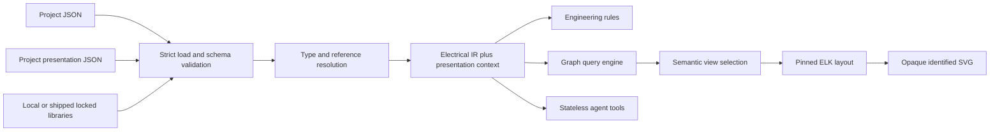

# Architecture

## Authority boundary

Thermite Schematics is a compiler, query engine, and deterministic schematic renderer for a
text-based electrical system description. Project JSON and locked library bytes are
authoritative. Electrical IR, query results, SVG, reports, and indexes are derived
artifacts.



An agent proposes structured requests and guarded source edits. Deterministic code
owns parsing, schema checks, lock verification, electrical validity, topology,
selection, layout, and SVG geometry.

## Implemented packages

The repository has seven private workspaces:

- `@thermite/schema`: canonical schemas, generated source types, strict parsing,
  schema registry, and diagnostic locations;
- `@thermite/core-library`: shipped `core@0.1.0` bytes and deterministic
  resolver metadata;
- `@thermite/compiler`: loading, lock verification, type/reference resolution,
  IR construction, net derivation, and engineering rules;
- `@thermite/query`: deterministic read-only queries over successful in-memory
  IR;
- `@thermite/render`: semantic selection, pinned ELK layout, SVG sheets and
  printable packets;
- `@thermite/agent-tools`: six typed stateless tools and guarded JSON Patch; and
- `@thermite/cli`: the human and JSON-agent `thermite` transport plus deterministic
  project initialization.

Package roots are API boundaries. Serialized IR is not accepted as a shortcut into
query or rendering, and no package exposes a persistent project session.

## Project composition

An initialized project has one manifest, one referenced presentation document, one
lock, three source documents, the copied agent guide, and a visible local core library:

```text
AGENTS.md
system.json
presentation.json
electrical-system.lock.json
devices/equipment.json
connections/control-power.json
potentials/potentials.json
libraries/core/library.json
libraries/core/types/*.json
```

`system.json` retains the backward-compatible `electrical-system/0.1` format:

```json
{
  "format": "electrical-system/0.1",
  "project": { "name": "Motor Starter Example" },
  "sources": [
    "devices/**/*.json",
    "connections/**/*.json",
    "potentials/**/*.json"
  ],
  "presentation": "presentation.json",
  "libraries": [{ "name": "core", "version": "0.1.0", "path": "libraries/core" }]
}
```

The optional presentation path is safe, portable, project-contained, and loaded as
one `project_presentation` document. Presentation is removed from source-glob
dispatch if the same canonical file matches a source pattern. Alias and reparse
escapes remain invalid.

`presentation.json` supports `project-presentation/0.1` and `/0.2`, with revision,
one lowercase six-digit canvas color, and up to four title lines. Optional page
settings control printable paper size, orientation and margins. The compiler
returns normalized presentation beside IR. Defaults are revision `UNSPECIFIED`,
background `#ffffff`, and no authored lines; printable pages default to Tabloid
landscape with a 10 mm margin. See [formats and compatibility](formats-and-compatibility.md).

## Library resolution and locking

A dependency with an explicit `path` always uses the local path loader. Omitting
`path` selects only a library shipped by exact name/version; the shipped set is
`core@0.1.0` in `@thermite/core-library`. There is no npm, network,
`NODE_PATH`, environment, cwd-ancestor, or user-cache fallback.

The internal shipped locator `ais-shipped:core@0.1.0` is lock/IR provenance, never
an authored resolution signal. Stable shipped source paths begin
`@thermite/core-library/`, independent of the installation prefix.

The lock remains version 1. Each entry binds version, path/locator, aggregate and
per-file integrity, and resolution kind. Legacy entries without `resolutionKind`
normalize to `local` after schema validation; every writer emits explicit `local`
or `shipped`. Compilation verifies the lock but never rewrites it.

## Compilation pipeline

One public `compileProject` call performs:

1. project root and document identity checks;
2. strict parsing and schema/structural validation;
3. local or shipped library loading and lock verification;
4. type catalog, instance expansion, and reference resolution;
5. graph normalization and electrical-net derivation;
6. `electrical-ir/0.1` assembly;
7. deterministic engineering-rule evaluation; and
8. normalized diagnostics plus detached presentation.

Errors before assembly expose no partial IR. Rule errors also fail the compile.
Warnings accompany a successful complete IR. Every downstream product path consumes
only that success branch.

The IR contains resolved devices/types/terminals, physical conductive elements,
derived nets, functional relations, effective electrical properties, stable source
provenance, indexes, and explicit library resolution provenance. Canvas, title,
manual coordinates, and saved drawing pages do not belong in electrical IR.

## Query and render pipeline

The query engine hydrates compiler-owned indexes without rebuilding or mutating them.
It exposes inspection, physical neighbors, conductive traversal, complete net
membership, and cable membership. It does not simulate contact state, energization,
current, voltage drop, or load flow.

The renderer accepts successful IR, one closed
`schematic-view-request/0.1` or `schematic-view-request/0.2` request, and optional
compiled presentation. It normalizes the semantic view, selects an electrical
subgraph, maps only supported symbols, constructs a fresh pinned ELK DTO, validates
returned geometry, then emits canonical `render/0.3` SVG.

The original continuous SVG renderer preserves its geometry and adds a deterministic
footer. Printable rendering composes circuit sheets, complete conductor inventories,
and documentation tables into SVG, HTML or PDF packets. Pagination and compact
layout preserve electrical topology and minimum circuit text size; requests that
cannot fit safely fail explicitly. The [format reference](formats-and-compatibility.md)
describes packet limits, continuations, output formats and semantic review.

Electrical selection and symbol semantics constrain the layout solver. Geometry
never creates connectivity: crossing paths are not electrical junctions unless the
compiled topology says so. Agents select semantic views and edit source facts;
they do not place symbols or draw conductors. Reproducible output requires the
same resolved model, normalized request, presentation, and renderer/dependency
versions. Saved requests and generated drawings remain derived views, not a second
electrical source of truth.

## Agent boundary

The agent namespace composes existing package APIs:

- `resolve` searches or resolves project objects;
- `inspect` returns one-hop semantic inspection;
- `query` exposes only neighbors, trace, net, and cable;
- `validate` performs one fresh compile;
- `create-view` passes the public request and compiler presentation to render; and
- `apply-source-patch` applies integrity-guarded `json-patch/0.1`.

Request/result/report formats remain `agent-tool-request/0.1`,
`agent-tool-result/0.1`, and `agent-tool-report/0.1`. Each CLI dispatch is
stateless. Success alone writes a result on stdout; stderr always carries the report
after dispatch. Failure leaves stdout empty.

Patches may target existing project source and the one referenced presentation
document. They cannot create, delete, or rename files or mutate the manifest, lock,
`AGENTS.md`, or library bytes. The guard includes project/presentation/source/lock
and local-library state; shipped package bytes are excluded from the project snapshot
under the immutable installed-package premise and remain lock-verified on compilation.

## Database and physical-model policy

No database is authoritative. A future search or collaboration index must be
rebuildable from the committed project and locked libraries.

Panel/enclosure geometry is a separate future model referencing the same immutable
component UIDs. Electrical source intentionally contains no schematic X/Y
coordinates. Logical topology, physical installation, and drawing presentation remain
separate concerns.

## Distribution

Users run a versioned runtime ZIP or a source checkout with Bun 1.4.2. A runtime
contains the built engine, production dependencies, schemas, templates, core
library, fonts and licenses. Its manifest records source identity and payload
hashes. Source users install from the frozen Bun lock and build locally. Both
workflows initialize a separate electrical project with the same JSON formats.
See [runtime packaging](runtime-package.md) and [platform checks](platforms.md).

The historical private v0.2.0 tarball and its protected publisher remain separate.
Their [legacy release contract](legacy/private-release.md) does not govern the
current runtime ZIP workflow.

## Standards posture

The architecture is standards-aware without claiming compliance. IEC 81346 informs
system structuring and designations; IEC 61082 informs electrotechnical information
presentation; IEC 60617 informs symbol semantics and terminology. Mappings and
independently authored rendering assets must still respect the standards' licensing
and implementation boundaries.
